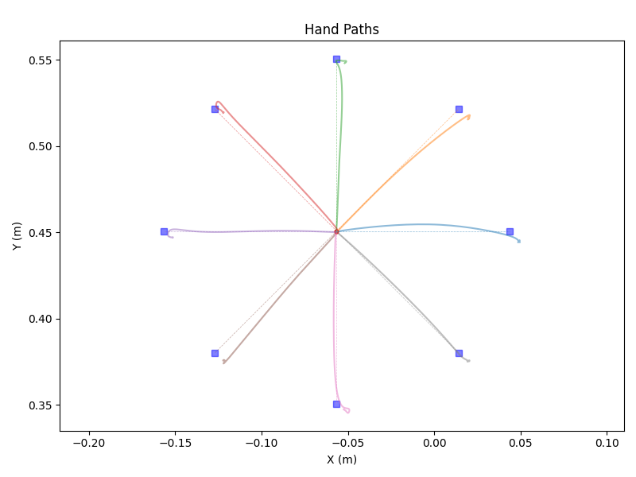
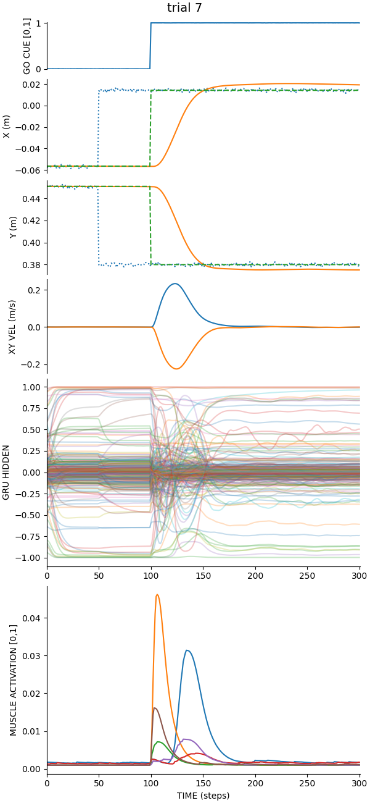

# motornet_demo

## demo1.py
simple demo of training a motornet system

- two joint planar arm (shoulder, elbow)
- 6 Hill-type muscles based on Kistemaker, Wong & Gribble (2010) J. Neurophysiol. 104(6):2985-94
- training on point-to-point reaches to random targets in the workspace
- null-field training by default though curl FFs are an option
- center-out reaches to 'test' the network
- various plots

## Installing motornet

Assumption: you have python3.12 and the [uv](https://docs.astral.sh/uv/) python package manager installed.

On MacOS use the [Homebrew](https://brew.sh) package manager:

```{shell}
brew install python@3.12 uv
```

Then a one-time setup for motornet_demo:

```{shell}
bash setup.sh
```

## Starting point

After you setup as above, you can run the `demo1.py` script like this:

```{shell}
uv run python demo1.py
```

## Parallel computing on Apple Silicon

Doing `brew install libomp` will help make things stable when doing parallel training especially with compile directives.

## Example Results




