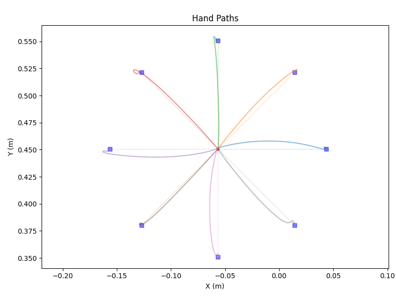
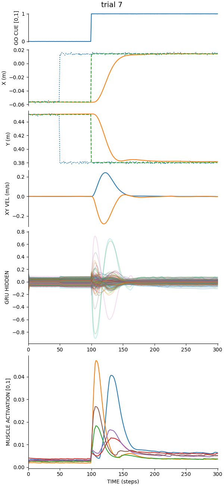

# motornet_demo

## demo1.py
simple demo of training a motornet system

- two joint planar arm (shoulder, elbow)
- 6 Hill-type muscles based on Kistemaker, Wong & Gribble (2010) J. Neurophysiol. 104(6):2985-94
- training on point-to-point reaches to random targets in the workspace
- null-field training by default though curl FFs are an option
- center-out reaches to 'test' the network
- various plots

## Installing motornet

Assumption: you have python3.12 installed. On MacOS:

```{shell}
brew install python@3.12
```

I use `pip` to organize Python environments.

```{shell}
python3.12 -m venv .venv
source .venv/bin/activate
python3.12 -m pip install -U pip
pip install -r requirements.txt --no-cache-dir --force
```

## Starting point

After you install motornet and the libraries above, activate the venv:

```{shell}
source .venv/bin/activate
```

## Parallel computing on Apple Silicon

Doing `brew install libomp` will help make things stable when doing parallel training especially with compile directives.

## Example Training

Using `n_batch=10000`:



